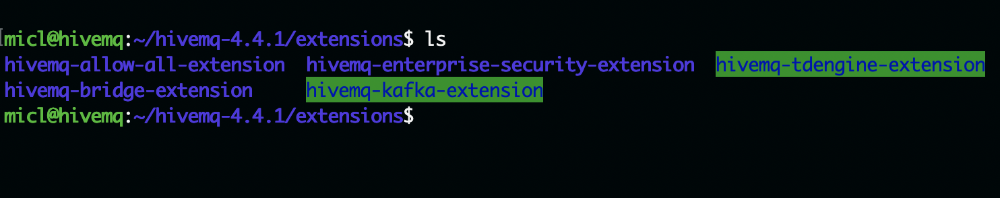
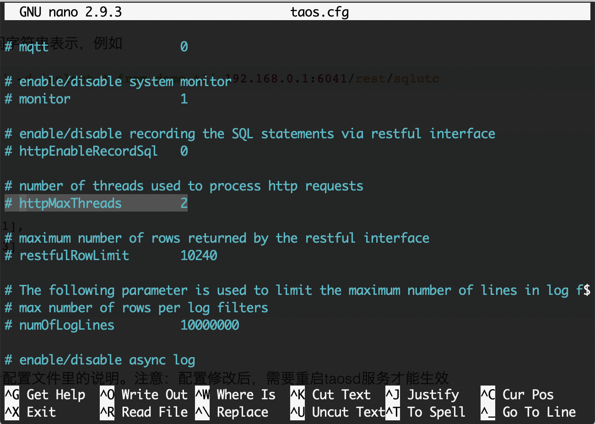

# TDengine Extension of HiveMQ (项目代号: Catfish)

这是一个支持将数据保存到TDEngine的HiveMQ扩展项目。

For English user, please read [English](index.md).

Content:

+ [设计文档](design_cn.md)
+ [测试报告](testing.md)

## 部署插件

1.请从Gihub版本页面中下载hivemq-tdengine-extension-1.0-distribution.zip。
2.解压缩文件：hivemq-tdengine-extension-1.0-distribution.zip 到本地文件夹上。
3. 复制整个文件夹到 {HIVEMQHOME}/extensions/ 如下:

1. 在插件目录hivemq-tdengine-extension之下，创建一个名为 "TDengine.properties"的配置文件，内容如下:

TDengine.properties
```shell
host: {TDengine Server IP/hostname}
port:6041
user: {TDengine account}
password:{password}

prefix:mqtt_msg
database:testdb

reportingInterval:1
connectTimeout:5000
```
5. 通过运行 {HIVEMQHOME}/bin/run.sh 启动HiveMQ 服务

请注意:
****
不需要在TDengine服务中创建任何数据库或表。 只需通过TDengine.properties中的数据库和前缀属性指定数据库名称和表名称。这些数据库对象将自动创建。
****

## 配置防火墙

TDengine扩展需要访问位于TDengine服务器上位于6041端口的TDengine REST API服务。请配置防火墙以启用出站规则以与6041通信。

默认情况下，HiveMQ服务将1883暴露给已取消的MQTT通信，请启用它。

## 调整I/O 性能

有一种方法可以扩展I/O性能：

+ 扩展RESTful API服务线程数。

### 改善REST API服务线程数

TDengine扩展使用REST API与TDengine服务进行通信。 默认情况下，只有2个线程服务HTTP通信。 如果您的MQTT流量很大，请添加httMaxThreads的数量。



详细信息请参考:
[TDengine 配置文档](https://www.taosdata.com/en/documentation/administrator/#Configuration-on-Server)

## 从源代码构建

建立这个项目非常简单。 它只需要OpenJDK 11和Maven。

安装OpenJDK11，请参考: https://openjdk.java.net/install/.

安装Maven，请参考：https://maven.apache.org/install.html.

然后，您就可以直接构建代码了。

```shell

# Get code from Github.
> git clone https://www.github.com/micli/Catfish.git
# change current folder.
> cd Catfish/hivemq-tdengine-extension/
# Build extension
> mvn package

```
